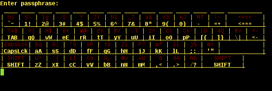

scramlkb
========

Passphrase entry utility that aims to defeat hardware keyloggers and low-resolution spy cameras

**Note that this is alpha software, things may not work as expected.**



_Explanation: `scramlkb` maps the red characters to the yellow characters displayed on the line below.
The mapping is updated on each keypress by performing a Knuth (aka Fisher-Yates) shuffle of the red characters using entropy from `/dev/urandom`.
The yellow keys stay in place, resembling the QWERTY keyboard layout._

_Example: In the screenshot above, `2` would map to `h`; `6` -> `e`; `k` -> `y`.
Thus, `26k` would render `hey`. Except the entire mapping would be randomly shuffled after the first entry of `2`, and again for each consecutive key press, of course._

## Features
* `systemd-ask-password` support, (almost working) replacement for `systemd-tty-ask-password-agent` (for disk passphrases on boot, ..)
* mixed plaintext / scrambled entry, for menu systems

## Similar/related tools
- [Gridfire by reid-k](https://github.com/reid-k/gridfire), written in Python
- [vkeyb](https://github.com/qnrq/vkeyb), written in C
  - abandonware, you need to fix the [bias error on line 22](https://github.com/qnrq/vkeyb/blob/master/vkeyb.c#L22) by changing it from `while(r <` to `while(r >= amount_of_elements)`
- [gpggrid](http://web.archive.org/web/20111009210604/http://tinfoilhat.shmoo.com/source/gpggrid.c), written in C for the Tinfoil Hat Linux project (discontinued) by Shmoo

## Usage

#### systemd "Password Agents Specification"

`scramlkb` partially implements the [Free Desktop specification for password agents](http://www.freedesktop.org/wiki/Software/systemd/PasswordAgents).

The strategy chosen is to aiming towards parameter compatibility with the `systemd-tty-ask-password-agent` [(man page)](http://www.freedesktop.org/software/systemd/man/systemd-tty-ask-password-agent.html) for the common use cases, enabling `scramlkb` to be used as a drop-in replacement.

Currently implemented parameters:
```
./scramlkb [--watch]
--watch     Watch the `/run/systemd/ask-password/` directory for password entry requests
```

Password requests can be generated with `sudo systemd-ask-password --no-tty "enter your password"`. Note that `scramlkb` must have permissions to read the socket (created by root in this case).

Additional references:
- `man systemd-ask-password`
- `man systemd-tty-ask-password-agent`

#### interactive pty mode

`scramlkb` can also be used in regular pseudo-ttys by calling the binary without the `--watch` parameter. This is provided to ease the use of `scramlkb` in scripts and day-to-day interactive input of sensitive data.

The parameters for this mode of operation are detailed below:

```
Usage: (./scramlkb [mode, mode, ..]) where mode is either 'c'|'u'|'p' for unscrambled lines or an integer (count of scrambled lines)
Example: (scramlkb c c 2 c) -> reads two plaintext lines, two scrambled lines, then one unscrambled line
```


